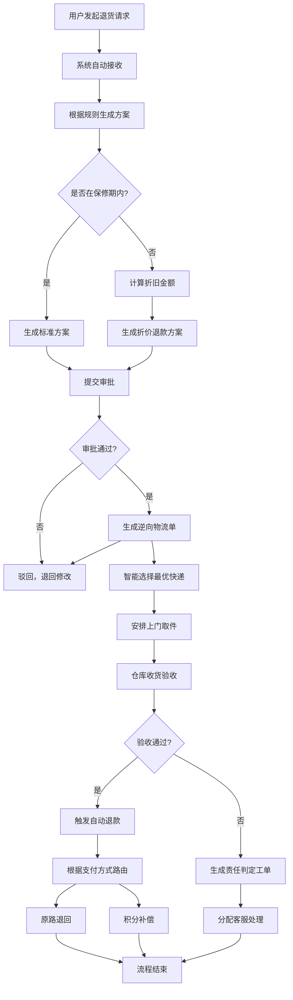

## 1. 产品概述

智能退货管理系统 - 自动化处理电商平台每日数千单退货请求，涵盖退货方案自动生成、保修期校验、逆向物流调度、仓库验收、退款处理全生命周期管理。系统支持智能折旧计算、责任判定、统计报表与异常监控，实现高效的售后退货管理平台。

- 主要目的：解决传统退货流程的人工操作繁琐、效率低、易出错等问题，通过自动化引擎提升退货处理效率，降低运营成本
- 目标用户：售后管理人员、仓库操作人员、财务人员、客服人员

## 2. 核心功能

### 2.1 用户角色

| 角色 | 核心权限 |
|------|----------|
| 系统管理员 | 系统配置、用户管理、规则引擎配置 |
| 售后管理员 | 退货审批、退货方案审核、异常处理 |
| 仓库管理员 | 退货验收、质量检测、物流调度 |
| 财务人员 | 退款审核、报表导出 |
| 客服人员 | 责任判定工单处理、客户沟通 |

### 2.2 功能模块

1. **首页仪表盘**：实时数据概览、待办任务、异常告警、趋势图表
2. **退货请求管理**：退货列表、详情查看、状态跟踪
3. **退货方案生成**：自动生成退货方案、规则引擎、折旧计算
4. **审批流程**：方案审批、审批历史
5. **逆向物流管理**：物流单生成、快递选择、物流跟踪
6. **仓库验收管理**：质量验收、验收记录
7. **退款处理**：自动退款、支付路由
8. **责任判定工单**：工单生成、责任判定、工单分配
9. **统计报表中心**：退货率统计、原因分布、物流成本分析
10. **系统设置**：规则配置、用户权限
11. **日志与监控**：操作日志、异常告警

### 2.3 页面详情

| 页面名称 | 模块名称 | 功能描述 |
|-----------|----------|---------|
| 首页仪表盘 | 数据概览卡片 | 今日退货量、待处理数、异常数、退货率趋势图 |
| 首页仪表盘 | 待办任务列表 | 待审批、待验收、待处理工单快捷入口 |
| 首页仪表盘 | 异常告警面板 | 超24小时未验收、退款失败等异常实时提醒 |
| 退货请求列表 | 筛选搜索 | 按订单号、商品、时间段、状态组合筛选 |
| 退货请求列表 | 退货详情 | 完整退货生命周期状态追踪时间线 |
| 退货方案详情 | 方案生成 | 根据商品类别、购买时长、客户等级自动计算 |
| 退货方案详情 | 折旧计算 | 超保修期商品自动计算折旧率与折价退款 |
| 审批管理 | 审批操作 | 通过、驳回、审批意见 |
| 逆向物流管理 | 物流单管理 | 快递智能推荐（时效评分选择最优快递） |
| 仓库验收 | 质量验收 | 验收通过/不通过、损坏情况记录 |
| 退款处理 | 退款详情 | 原路退回/积分补偿自动路由 |
| 责任工单 | 工单列表 | 损坏商品责任判定与客服分配 |
| 统计报表 | 报表中心 | 退货率趋势、退款原因分布、物流成本分析 |
| 统计报表 | 导出功能 | PDF和Excel批量导出带趋势图表报告 |
| 系统设置 | 规则配置 | 退货规则、保修期配置 |
| 系统设置 | 用户管理 | 角色权限配置 |

## 3. 核心流程

用户发起退货请求 → 系统自动生成退货方案（换货/退款/仅退款）→ 保修期校验 → 折旧计算（超保修期）→ 审批 → 生成逆向物流单（选择最优快递 → 仓库验收 → （验收通过 → 自动退款 → （原路退回/积分补偿）或（验收不通过 → 生成责任判定工单 → 客服处理）→ 每日凌晨自动生成统计报告 → 异常实时推送

## 4. 用户界面设计

### 4.1 设计风格

- 主色调：深蓝色 `#1e3a5f`，辅助色：橙色 `#ff6b35`，强调色：青色 `#00d4aa`
- 中性色：深灰背景 `#0f172a`，浅色卡片 `#1e293b`，边框 `#334155`
- 按钮风格：微立体，圆角 8px，悬停微上浮效果
- 字体：显示字体使用 Space Grotesk，正文字体使用 Inter
- 布局风格：左侧导航栏 + 顶部栏 + 主内容区卡片式布局
- 视觉：深色科技风格，数据可视化使用 ECharts
- 图标风格：线性图标，统一 stroke 宽度 1.5px

### 4.2 页面设计概览

| 页面名称 | 模块名称 | UI 元素 |
|---------|---------|---------|
| 首页仪表盘 | 数据概览 | 渐变卡片，KPI 指标，微交互动效 |
| 退货列表 | 表格数据 | 斑马纹表格，状态标签颜色区分，悬停高亮 |
| 退货详情 | 时间线 | 垂直时间线，状态流转动画 |
| 统计报表 | 图表区域 | 多维度图表，渐变填充，动画过渡 |
| 审批页面 | 表单区域 | 玻璃拟态表单，聚焦高亮边框 |

### 4.3 响应式设计

- 桌面端优先设计（≥1280px）
- 平板端（768px-1279px）：侧边栏可折叠，表格自适应
- 移动端（<768px）：抽屉式导航，卡片堆叠布局

### 4.4 动效设计

- 页面加载：卡片依次淡入上浮（staggered 动画）
- 状态变化：状态标签颜色渐变过渡
- 数据更新：数字滚动动画
- 悬停交互：卡片微上浮 + 阴影加深
- 图表加载：骨架屏占位 → 渐变填充
