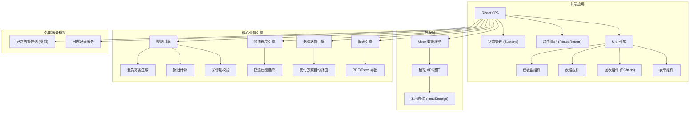
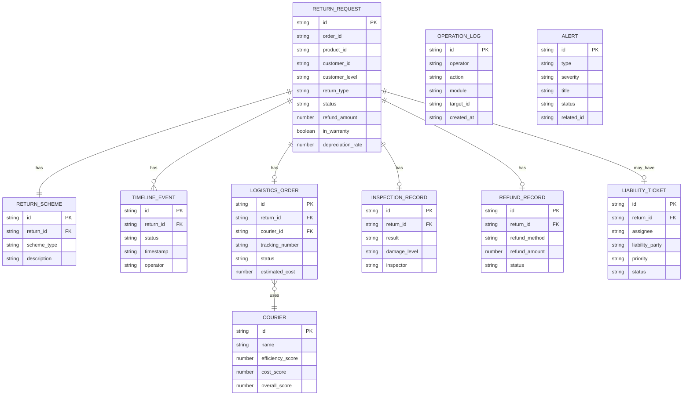

## 1. 架构设计



## 2. 技术选型

- **前端框架**: React@18 + TypeScript
- **构建工具**: Vite@5
- **样式方案**: Tailwind CSS@3 + PostCSS
- **状态管理**: Zustand (轻量级状态管理)
- **路由**: React Router@6
- **图表**: ECharts@5
- **图标**: Lucide React
- **导出**: jsPDF + SheetJS (xlsx)
- **日期处理**: dayjs
- **数据**: Mock 数据服务，模拟高并发场景

## 3. 路由定义

| 路由路径 | 页面名称 | 用途 |
|---------|---------|------|
| `/` | 首页仪表盘 | 数据概览、待办、告警 |
| `/returns` | 退货请求列表 | 退货申请管理、筛选查询 |
| `/returns/:id` | 退货详情页 | 退货全生命周期追踪 |
| `/approvals` | 审批管理 | 退货方案审批 |
| `/logistics` | 逆向物流管理 | 物流单管理、快递调度 |
| `/warehouse` | 仓库验收 | 质量验收管理 |
| `/refunds` | 退款处理 | 退款记录与追踪 |
| `/tickets` | 责任工单 | 责任判定工单管理 |
| `/reports` | 统计报表 | 多维度数据分析与导出 |
| `/settings` | 系统设置 | 规则配置、用户管理 |
| `/logs` | 操作日志 | 操作记录与异常监控 |

## 4. 核心模块 API 接口设计 (TypeScript 类型)

```typescript
// 退货请求
interface ReturnRequest {
  id: string;
  orderId: string;
  orderDate: string;
  productId: string;
  productName: string;
  productCategory: string;
  productPrice: number;
  customerId: string;
  customerName: string;
  customerLevel: 'normal' | 'silver' | 'gold' | 'platinum';
  returnReason: string;
  returnType: 'exchange' | 'refund' | 'refund_only';
  warrantyExpireDate: string;
  inWarranty: boolean;
  depreciationRate: number;
  depreciationAmount: number;
  refundAmount: number;
  status: ReturnStatus;
  createdAt: string;
  updatedAt: string;
  timeline: TimelineEvent[];
}

type ReturnStatus = 
  | 'pending_review'
  | 'reviewing'
  | 'approved'
  | 'rejected'
  | 'logistics_created'
  | 'picked_up'
  | 'in_transit'
  | 'warehouse_received'
  | 'inspecting'
  | 'inspection_passed'
  | 'inspection_failed'
  | 'refunding'
  | 'refund_completed'
  | 'ticket_created'
  | 'completed';

// 时间线事件
interface TimelineEvent {
  status: ReturnStatus;
  timestamp: string;
  operator: string;
  remark?: string;
}

// 逆向物流单
interface LogisticsOrder {
  id: string;
  returnId: string;
  orderId: string;
  courierId: string;
  courierName: string;
  trackingNumber: string;
  estimatedCost: number;
  actualCost: number;
  estimatedDays: number;
  actualDays: number;
  status: 'created' | 'picked' | 'in_transit' | 'delivered' | 'exception';
  pickupAddress: Address;
  returnAddress: Address;
  createdAt: string;
}

// 快递
interface Courier {
  id: string;
  name: string;
  efficiencyScore: number;
  costScore: number;
  overallScore: number;
  avgDeliveryDays: number;
  avgCost: number;
}

// 仓库验收
interface InspectionRecord {
  id: string;
  returnId: string;
  inspector: string;
  inspectionResult: 'passed' | 'failed';
  damageLevel: 'none' | 'minor' | 'moderate' | 'severe';
  damageDescription: string;
  damageImages: string[];
  receivedQuantity: number;
  inspectedAt: string;
}

// 退款记录
interface RefundRecord {
  id: string;
  returnId: string;
  orderId: string;
  originalPaymentMethod: 'alipay' | 'wechat' | 'bank' | 'points';
  refundMethod: 'original' | 'points';
  refundAmount: number;
  pointsAmount: number;
  status: 'pending' | 'processing' | 'success' | 'failed';
  transactionId: string;
  processedAt: string;
}

// 责任工单
interface LiabilityTicket {
  id: string;
  returnId: string;
  orderId: string;
  assignee: string;
  liabilityParty: 'customer' | 'merchant' | 'logistics' | 'unknown';
  status: 'pending' | 'processing' | 'resolved' | 'closed';
  priority: 'low' | 'medium' | 'high' | 'urgent';
  description: string;
  resolution: string;
  createdAt: string;
  resolvedAt: string;
}

// 异常告警
interface Alert {
  id: string;
  type: 'inspection_timeout' | 'refund_failed' | 'logistics_exception' | 'ticket_overdue';
  severity: 'info' | 'warning' | 'error' | 'critical';
  title: string;
  description: string;
  relatedId: string;
  status: 'unread' | 'read' | 'resolved';
  createdAt: string;
}

// 操作日志
interface OperationLog {
  id: string;
  operator: string;
  action: string;
  module: string;
  targetId: string;
  detail: string;
  ip: string;
  createdAt: string;
}

// 统计数据
interface ReportData {
  date: string;
  totalReturns: number;
  returnRate: number;
  approvedRate: number;
  averageProcessingHours: number;
  refundTotalAmount: number;
  logisticsTotalCost: number;
  reasonDistribution: { reason: string; count: number }[];
  categoryReturnRate: { category: string; rate: number }[];
}
```

## 5. 目录结构

```
src/
├── assets/              # 静态资源
├── components/          # 通用组件
│   ├── layout/         # 布局组件
│   ├── ui/             # 基础UI组件
│   └── charts/         # 图表组件
├── pages/              # 页面组件
│   ├── Dashboard/
│   ├── Returns/
│   ├── Approvals/
│   ├── Logistics/
│   ├── Warehouse/
│   ├── Refunds/
│   ├── Tickets/
│   ├── Reports/
│   ├── Settings/
│   └── Logs/
├── store/              # 状态管理 (Zustand)
│   ├── returns.ts
│   ├── logistics.ts
│   ├── reports.ts
│   └── user.ts
├── services/           # 业务服务层
│   ├── api.ts          # 模拟 API
│   ├── mock/           # Mock 数据
│   ├── engine/         # 业务引擎
│   │   ├── rulesEngine.ts
│   │   ├── logisticsEngine.ts
│   │   └── refundEngine.ts
│   └── export/         # 导出服务
│       ├── pdfExport.ts
│       └── excelExport.ts
├── types/              # TypeScript 类型定义
├── utils/              # 工具函数
├── hooks/              # 自定义 Hooks
├── constants/          # 常量配置
├── App.tsx
├── main.tsx
└── index.css
```

## 6. 数据模型 ER 图


